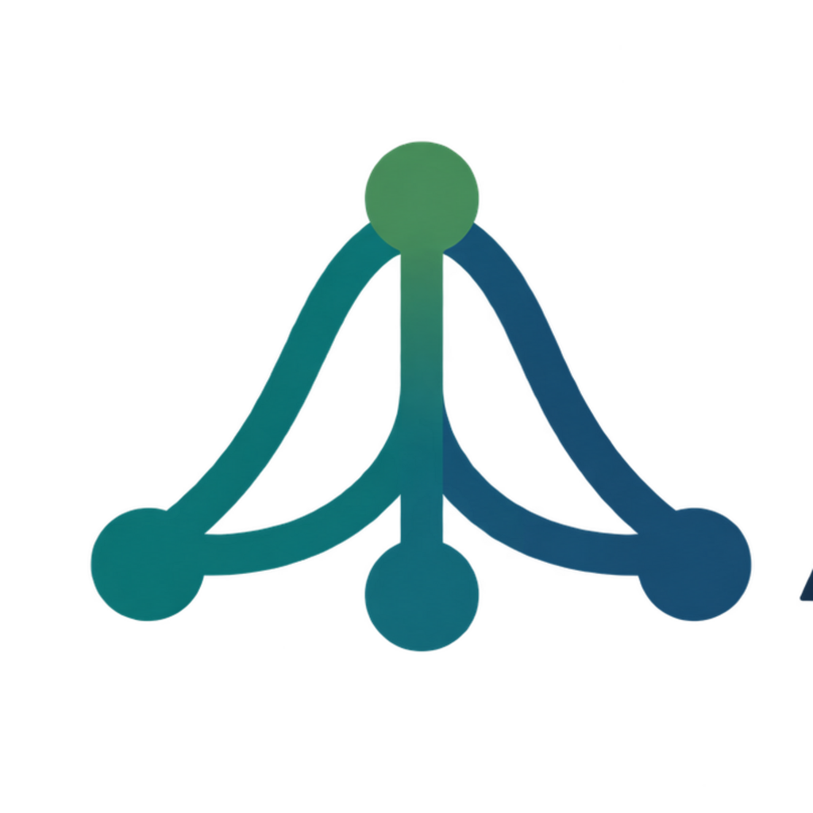
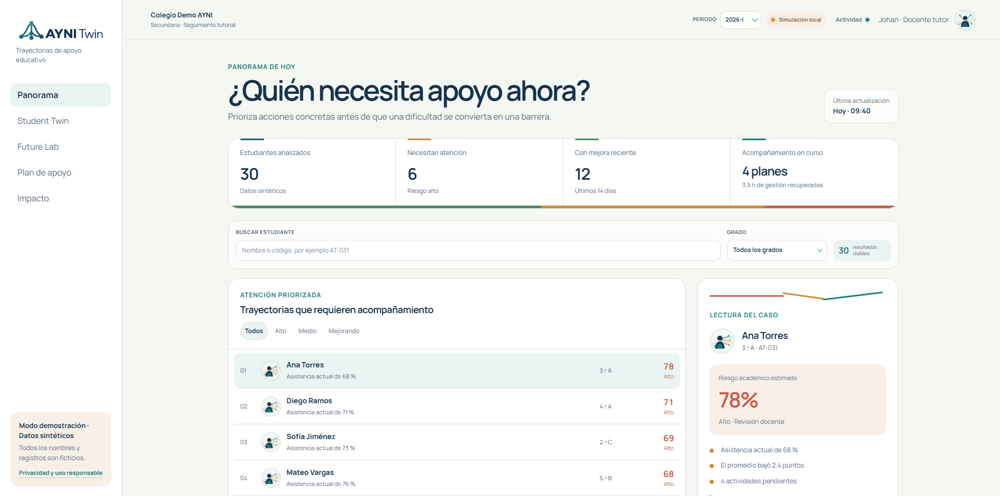
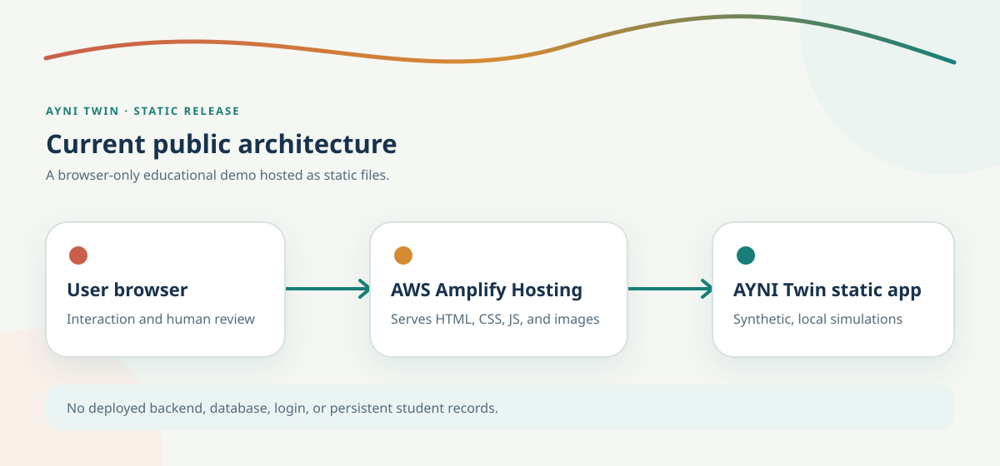

  

<h1 align="center">AYNI Twin</h1>

<strong>Turn early warning signs into timely, coordinated support.</strong>

A Spanish-first, interactive education demo for exploring student support decisions with fictional data.

  
  

  
  
  

## Why AYNI Twin?

Attendance, grades, and unfinished work can signal that a student needs support. Seeing those signals is only the start: an educator still needs to understand what changed and coordinate a useful response.

AYNI Twin connects those steps in one exploratory journey. Its name draws on *ayni*, an Andean principle of reciprocity and mutual support: progress is approached as a shared effort, not a label placed on a student.

## The experience

| Stage | Purpose | Educator outcome |
| --- | --- | --- |
| **Impact Dashboard** | Surface early-warning signals across fictional profiles. | Know where to look first. |
| **Student Twin** | Explain the factors behind an illustrative risk estimate. | Understand the context, not just a score. |
| **Future Lab** | Adjust support options and compare simulated paths. | Discuss possible next actions. |
| **Support Plan** | Edit a local, 14-day intervention draft. | Review and approve a concrete plan. |
| **Impact Proof** | Compare an estimate with a hypothetical follow-up. | See how a later review could inform a new decision. |

## Product preview

  

<em>Impact Dashboard turns scattered warning signs into a prioritized, explainable view for educators.</em>

## How it works

**Educator → browser → AWS Amplify Hosting → AYNI Twin static application.** Amplify serves the static Next.js export; the browser runs the deterministic calculations and interactions. The current release has no deployed backend or database, and it does not persist changes between sessions.

*The diagram describes the public release, not the undeployed technical prototype retained in the repository.*

## Responsible use

> **Demonstration only.** All 30 student profiles are fictional, all displayed outcomes are simulated, and no real student data is collected or stored. AYNI Twin does not diagnose, make automated educational decisions, or guarantee outcomes. An educator remains responsible for interpreting the information and making final decisions.

## Built with Codex, hosted on AWS

Codex supported the product structure, interface, simulation logic, tests, accessibility decisions, static export, deployment troubleshooting, and a **read-only AWS CLI verification** of the Amplify application. The agent did not make educational decisions. See the [development record](docs/agent-evidence.md).

## Hackathon submission

AYNI Twin is submitted to AWS Zero to Shipped in the **Social Good** category and **Startups** track.

| Requirement | AYNI Twin evidence |
| --- | --- |
| Coding agent connected to AWS | Codex verified the Amplify application with a read-only request using temporary credentials. |
| Public application running on AWS | [Live demo on AWS Amplify Hosting](https://main.ds9xcp2xdxwdm.amplifyapp.com). |
| Application category | Social Good. |
| Track | Startups. |
| Original project | [AYNI Twin repository](https://github.com/JohanDEVnet/AYNI-Twin) and project documentation. |
| Development process | [Development record](docs/agent-evidence.md) and the validated local build workflow below. |

## Technology

  
  
  
  
  
  

The latest local validation passed linting, type checking, the production build, and all 21 automated tests.

## Run locally

Use Node.js 20 or newer and npm:

~~~bash
git clone https://github.com/JohanDEVnet/AYNI-Twin.git
cd AYNI-Twin
npm install
npm run dev
~~~

Open http://localhost:3000. No credentials or environment variables are required.

## Validate

~~~bash
npm run lint
npm run typecheck
npm test
npm run build
~~~

The production build generates the static site in `out/`. AYNI Twin is publicly available through AWS Amplify Hosting.

## Project structure

~~~text
src/
  app/           Next.js entry point and styles
  components/    Five-stage experience and shared UI
  data/          Fictional student profiles
  lib/           Deterministic risk and simulation logic
  types/         Shared TypeScript types
public/img/      AYNI branding, artwork, and current architecture diagram
docs/            Design, responsible-use, and development notes
infrastructure/  Undeployed historical prototype
~~~

## Current scope and roadmap

**Available now:** a public static demo with synthetic profiles, browser-based simulations, an editable local plan, and a hypothetical follow-up.

**Possible future work—not implemented:** institution-validated indicators, secure school integrations, role-based access, longitudinal intervention review, and privacy and governance controls. The current demo is not a production-ready school system or a validated predictor.

## Feedback and license

[Open an issue](https://github.com/JohanDEVnet/AYNI-Twin/issues) to report a problem or suggest an improvement. Please do not include real student information.

No open-source license has been selected for this repository.
