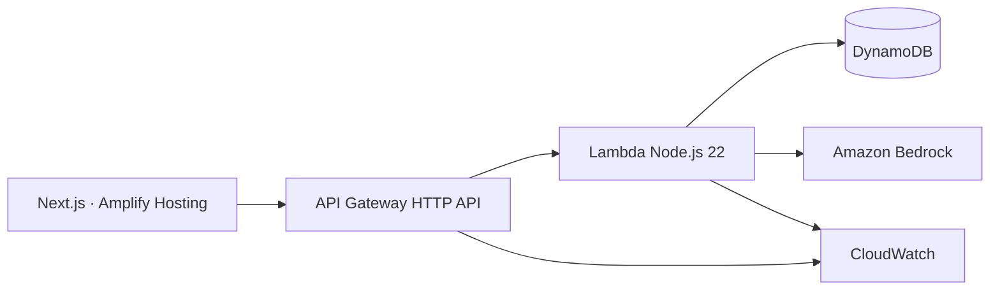

# AYNI Twin

**Simulating Better Futures for Students**

AYNI Twin ayuda a docentes a detectar una dificultad académica, comprender sus señales, comparar intervenciones y convertir una simulación en un plan de apoyo verificable. El sistema no decide el futuro de un estudiante: organiza evidencia para que una persona pueda actuar antes y revisar después el resultado.

Proyecto para **AWS Zero to Shipped 2026** · `#social-good` · `#startup`

## Qué demuestra

El recorrido principal utiliza treinta perfiles completamente sintéticos:

1. **Panorama:** prioriza trayectorias mediante un riesgo determinista y explicable.
2. **Student Twin:** separa factores, asignaturas, tendencias y observaciones docentes.
3. **Future Lab:** compara tres futuros y cinco intervenciones configurables.
4. **Plan de apoyo:** genera un borrador de 14 días con Amazon Bedrock o un fallback local validado.
5. **Impact Proof:** contrasta la estimación inicial con resultados observados.

La demo funciona localmente sin credenciales. Cuando `NEXT_PUBLIC_API_URL` está configurada, conserva el mismo recorrido y guarda escenarios, planes e intervenciones en AWS.

## Arquitectura




- **Next.js 16:** interfaz responsive y modo demo.
- **AWS SAM:** infraestructura reproducible.
- **API Gateway + Lambda:** ocho rutas del MVP.
- **DynamoDB:** estudiantes sintéticos, escenarios, planes e intervenciones.
- **Amazon Bedrock:** redacción estructurada del plan; nunca calcula el riesgo principal.
- **CloudWatch:** logs técnicos sin cuerpos, prompts ni datos personales.

Más detalle en [docs/architecture.md](docs/architecture.md).

## Modelo explicable

```text
riskScore = attendanceRisk × 0.40 + gradeRisk × 0.35 + assignmentRisk × 0.25
```

Los valores de la simulación son supuestos demostrativos configurables, no probabilidades científicas ni diagnósticos. La interfaz siempre muestra factores, nivel de confianza y revisión humana.

## Ejecución local

Requisitos: Node.js 20 o superior y npm.

```bash
npm install
npm run dev
```

Abre `http://localhost:3000`. No se necesita `.env.local` para usar el respaldo local.

Para conectar una API desplegada:

```bash
copy .env.example .env.local
```

Después reemplaza el valor de `NEXT_PUBLIC_API_URL` con el output `ApiUrl` de AWS SAM y reinicia el servidor.

## Verificación

```bash
npm test
npm run lint
npm run typecheck
npm run build
```

El backend tiene pruebas independientes:

```bash
cd infrastructure/functions/api
npm test
```

## Despliegue AWS

Con AWS CLI y SAM CLI autenticados:

```bash
cd infrastructure
sam build
sam validate --lint
sam deploy --guided
```

El despliegue pide `AllowedOrigin`, `StageName` y `BedrockModelId`. Después se cargan los treinta estudiantes sintéticos con `seed.mjs` y se configura `NEXT_PUBLIC_API_URL` en el frontend.

El procedimiento verificable y las capturas requeridas están en [docs/deployment-runbook.md](docs/deployment-runbook.md). No se publican IDs de cuenta, credenciales ni tokens.

## Uso responsable

- Solo datos sintéticos durante el hackathon.
- Sin atributos sensibles en la fórmula.
- Sin decisiones automáticas ni lenguaje determinista.
- Planes editables y aprobados por un docente.
- Respuesta local segura si Bedrock o la API no están disponibles.
- Validación de entradas, IAM de mínimo privilegio y logs sin cuerpos de solicitudes.

Consulta [docs/responsible-ai.md](docs/responsible-ai.md).

## Estado de entrega

- Recorrido local completo y responsive: listo.
- Backend e infraestructura SAM: listos y validados.
- Integración frontend con API y fallback: lista.
- URL pública, semilla remota y evidencia CloudWatch: pendientes de una sesión AWS autenticada.
- Video y publicación final: pendientes después del despliegue público.
- Guion de video y texto para Builder Center: preparados en `docs/`.

El historial verificable del agente se mantiene en [docs/agent-evidence.md](docs/agent-evidence.md).
# AYNI-Twin
